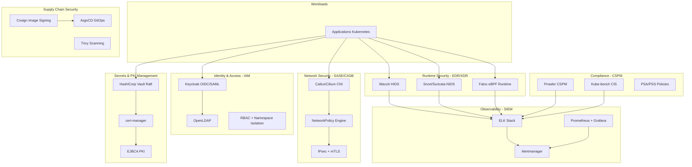

# Enterprise Security Stack on Kubernetes
> Démonstration d'une architecture de cybersécurité d'entreprise complète sur Kubernetes/OpenShift utilisant des outils open-source

[](https://opensource.org/licenses/MIT)
[](https://kubernetes.io)
[](https://www.redhat.com/en/technologies/cloud-computing/openshift)

## 🎯 Objectif

Ce projet démontre comment construire une **stack de cybersécurité d'entreprise moderne** sur Kubernetes, équivalente aux solutions commerciales EDR/SIEM/IAM/CASB utilisées dans les grandes organisations.

**Pourquoi ce projet ?** Les architectes cybersécurité d'entreprise cherchent des profils maîtrisant CrowdStrike, Splunk, Okta, Zscaler... mais souvent, les experts cloud-native ont déjà construit les **équivalents open-source** de ces solutions. Ce projet prouve cette équivalence.

## 🏗️ Architecture Globale



## 🔄 Équivalences avec Solutions Commerciales

| Catégorie | Solution Open-Source (ce projet) | Équivalent Commercial | Usage |
|-----------|----------------------------------|----------------------|-------|
| **IAM & Identity** | Keycloak + OpenLDAP + RBAC | Okta, Azure AD, CyberArk | SSO, MFA, contrôle d'accès |
| **EDR/XDR** | Wazuh + Snort + Falco | CrowdStrike, SentinelOne, Carbon Black | Détection runtime, threat hunting |
| **SIEM** | ELK Stack (Elasticsearch + Kibana) | Splunk, QRadar, Elastic Security | Corrélation logs, alerting |
| **Network Security** | Calico/Cilium + NetworkPolicy + mTLS | Palo Alto, Zscaler, Cisco Umbrella | Segmentation, Zero Trust Network |
| **SASE/CASB** | Istio Ambient + Cilium | Netskope, McAfee MVISION | Cloud Access Security Broker |
| **Secrets Management** | HashiCorp Vault + cert-manager | AWS Secrets Manager, Azure Key Vault | Rotation secrets, PKI lifecycle |
| **CSPM** | Prowler + Kube-bench + Checkov | Prisma Cloud, Wiz, Aqua | Posture management, compliance |
| **Supply Chain** | Cosign + SBOM + ArgoCD | Snyk, JFrog Xray | Image signing, provenance |
| **IaC Security** | Terraform + Ansible + Helm | Terraform Cloud, Spacelift | Infrastructure as Code sécurisé |
| **SOAR** | Ansible Playbooks + Webhooks | Cortex XSOAR, Splunk SOAR | Automated response |

## 📊 Cas d'Usage Couverts

### 1. Detection & Response (EDR/XDR)
- **Runtime Security** : Falco détecte les comportements suspects (shell reverse, privilege escalation)
- **Host Security** : Wazuh scanne fichiers, processus, syscalls
- **Network Security** : Snort/Suricata bloque les C2 connus
- **Alerting** : Tout converge dans ELK avec corrélation multi-source

### 2. Identity & Access Management (IAM)
- **SSO** : Keycloak fournit OIDC/SAML pour tous les services
- **RBAC** : Contrôle d'accès Kubernetes déclaratif
- **MFA** : Authentification multi-facteurs via Keycloak
- **Directory** : OpenLDAP comme backend d'identité

### 3. Network Segmentation (Zero Trust)
- **Micro-segmentation** : NetworkPolicy par namespace/label
- **Encryption** : mTLS automatique via cert-manager + Istio/Cilium
- **Egress Control** : Calico GlobalNetworkPolicy pour contrôle sortant

### 4. Compliance & Governance
- **CIS Benchmarks** : Kube-bench audite les clusters
- **Cloud Posture** : Prowler scanne l'infrastructure cloud
- **Policy Enforcement** : PSA/PSS + OPA Gatekeeper
- **Reporting** : Dashboards Grafana avec métriques de conformité

### 5. Supply Chain Security
- **Image Signing** : Cosign + Sigstore pour provenance
- **Vulnerability Scanning** : Trivy dans pipeline CI/CD
- **GitOps** : ArgoCD pour déploiements auditables
- **SBOM** : Génération automatique de Software Bill of Materials

## 🚀 Démarrage Rapide

### Prérequis
- Kubernetes 1.28+ ou OpenShift 4.14+
- kubectl / oc
- Helm 3.x
- Terraform 1.6+
- Ansible 2.15+

### Déploiement Complet (30 min)

```bash
# 1. Clone du repo
git clone https://github.com/r3rox/enterprise-security-k8s.git
cd enterprise-security-k8s

# 2. Infrastructure avec Terraform (si cloud)
cd terraform
terraform init
terraform apply -auto-approve

# 3. Configuration de base avec Ansible
cd ../ansible
ansible-playbook -i inventory/prod site.yml

# 4. Déploiement des stacks avec Helm
cd ../helm-charts
./deploy-all.sh

# 5. Vérification
kubectl get pods -n security-stack
```

### Demo Rapide avec Minikube (10 min)

```bash
# Démo sur cluster local
cd demo
./quick-start-minikube.sh

# Accès aux interfaces
# - Keycloak: http://localhost:8080
# - Kibana: http://localhost:5601
# - Grafana: http://localhost:3000
# - Wazuh: http://localhost:8443
```

## 📖 Documentation Détaillée

- [Architecture Technique](docs/architecture.md) - Détails d'implémentation
- [Guide des Équivalences](docs/equivalences.md) - Mapping détaillé OSS ↔ Commercial
- [Conformité & Standards](docs/compliance.md) - CIS, ANSSI, NIS2, ISO 27001
- [Pitch Entretien](docs/pitch-entretien-architecte-cyber.md) - One-pager pour entretiens

## 🎓 Cas d'Études Réels

### Cas 1 : Détection de Cryptomining
```
1. Falco détecte un processus suspect (xmrig)
2. Alerte envoyée à ELK
3. Corrélation avec Prometheus (CPU spike)
4. Playbook Ansible déclenché
5. Pod isolé via NetworkPolicy dynamique
6. Secrets rotés dans Vault
```

### Cas 2 : Supply Chain Attack
```
1. Trivy détecte une image non signée
2. ArgoCD refuse le déploiement
3. Alerte dans Slack via webhook
4. Image renvoyée pour signing avec Cosign
5. Validation SBOM avant déploiement
```

## 🏢 Contexte d'Entreprise

### Expérience Terrain
Cette stack a été déployée et opérée dans des environnements critiques :
- **Télécommunications** : 5G Core Network, infrastructures opérateurs
- **CloudRAN** : Workloads RAN containerisés
- **Multi-cloud** : Azure, AWS, cloud providers européens
- **Scale** : 300+ clusters, 5000+ nœuds, 50k+ pods

### Conformité Réglementaire
- ✅ **ANSSI** : Recommandations sécurité cloud
- ✅ **NIS2** : Directive européenne cybersécurité
- ✅ **ISO 27001** : Système de management sécurité
- ✅ **CIS Benchmarks** : Hardening Kubernetes
- ✅ **RGPD** : Protection données personnelles

## 🤝 Contribution

Les contributions sont bienvenues ! Voir [CONTRIBUTING.md](CONTRIBUTING.md)

## 📬 Contact

**[Z3ROX]** - Architecte Cloud & Cybersécurité
- LinkedIn: [https://github.com/Z3ROX-lab]
- Email: []
- Certifications: CCSP, AWS SA, ISO 27001 Lead Implementer, Security+

## 📄 Licence

MIT License - voir [LICENSE](LICENSE)

---

> 💡 **Note pour recruteurs** : Ce projet démontre une maîtrise complète de la cybersécurité d'entreprise via des implémentations cloud-native. Les principes (defense in depth, zero trust, least privilege) sont identiques aux solutions commerciales, avec l'avantage d'être open-source, auditables et sans vendor lock-in.
